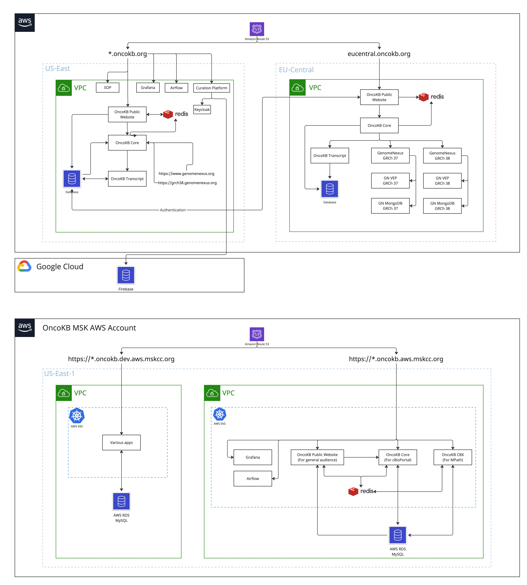

# OncoKB

This is the repo includes all configurations for OncoKB app that are running on the following clusters. All
configmap/secerts are stored
under [oncokb-deployment repo](https://github.com/knowledgesystems/oncokb-deployment/tree/master/credentails). Reach out
to HZ for access.

## System Architecture

  
Editable board is located here https://miro.com/app/board/uXjVMTJ_gKI=/

## Clusters

- **cbioportal-prod/oncokb** This is the shared account with cBioPortal which serves the OncoKB public apps that running
  behind oncokb.org. The cluster is under us-east-1.
- **oncokb-eu/default** This is a cluster served under eu-central-1 region. Use the credential above to access the
  cluster
- **oncokb-dev/default** This is the MSK dev cluster. Account: msk-oncokb-dev (762447640649)
- **oncokb-production/default** This is the MSK production cluster. Account: msk-oncokb-prod (084637913395)

## Manage clusters

- All clusters are served under AWS/EKS. We use [eksctl](https://eksctl.io/) to create nodegroups. Most of the clusters
  are not created by eksctl but can still be managed if it's created under AWS/EKS.
- All clusters use the default namespace to serve apps except the cbioportal-prod which is `oncokb`.
- All OncoKB clusters are on kubernetes 1.27. All clusters are supposed to be on the same version.
- We use helm(v3.5.2) to install charts.

## Services

### Redis

- We currently only use Redis Cluster in production.
    - Install
      using `helm install -n oncokb oncokb-redis-cluster -f oncokb_cluster_redis_values.yaml bitnami/redis-cluster --set password=<password>`
    - Delete using `helm uninstall -n oncokb oncokb-redis-cluster`
- You can find few sentinel configs here: oncokb/shared/redis
- We are sticking to helm chart `bitnami/redis-cluster --version 8.4.0`

### Airflow

- We have two versions of airflow running.
    - airflow.oncokb.org
    - airflow.oncokb.aws.mskcc.org
- The dags are located at https://github.com/oncokb/oncokb-pipeline/tree/master/oncokb-airflow/oncokb
- We are sticking to helm chart `bitnami/airflow --version 14.0.17`

### Prometheus/Grafana

- We use the kube-prometheus-stack to install prometheus and grafana
- We are sticking to helm chart `prometheus-community/kube-prometheus-stack --version 46.8.0 --set grafana.adminPassword=<pass>`

### Notes

#### Install Amazon EBS CSI driver

The driver is needed to manage the lifecycle of Amazon EBS volumes for persistent volumes.
It's required after upgrading k8s to version later than 1.22. See more
info [HERE](https://docs.aws.amazon.com/eks/latest/userguide/ebs-csi.html).
The following commands help creating the driver using eksctl(the only option in MSK cluster, see ntoe below)

- Creating an IAM OIDC provider for your
  cluster: https://docs.aws.amazon.com/eks/latest/userguide/enable-iam-roles-for-service-accounts.html
- Create iam service account.
    - The permsisisons-boundary(EngineerOrUserServiceRolePermissions) needs to be attached for all MSK clusters. This
      step needs to be done through eksctl or aws/cli. We need to modify `sts:AssumeRoleWithWebIdentity` if we do
      through management console which the logged in user does not have the permission to do.
    - The role name needs to start with `userServiceRole` if this is MSK cluster
      ```commandline
      eksctl create iamserviceaccount \
          --name ebs-csi-controller-sa \
          --namespace kube-system \
          --profile saml \
          --cluster [cluster-name] \
          --role-name userServiceRole-AmazonEBSCSIDriverRole \
          --role-only \
          --attach-policy-arn arn:aws:iam::aws:policy/service-role/AmazonEBSCSIDriverPolicy \
          --permissions-boundary arn:aws:iam::[account-id]:policy/EngineerOrUserServiceRolePermissions
          --approve
      ```
- Add Amazon EBS CSI add-on: https://docs.aws.amazon.com/eks/latest/userguide/managing-ebs-csi.html

#### Creating a new subdomain

To add a subdomain of oncokb.org, please follow the steps below:

1. Add host under spec.hosts in ingress/ingress_oncokb.yml
2. Under the same yaml file, add rule to handle traffic to the subdomain
3. Add k8s Service and Deployment under oncokb folder. The service name should be the same as the step 2. You can use
   oncokb/oncokb_public.yaml file as an example
4. Apply the Service/Deployment above by `kubectl apply -f [yaml file path you created above]`
5. Apply the modified ingress `kubectl apply -f ingress/ingress_oncokb.yml`
